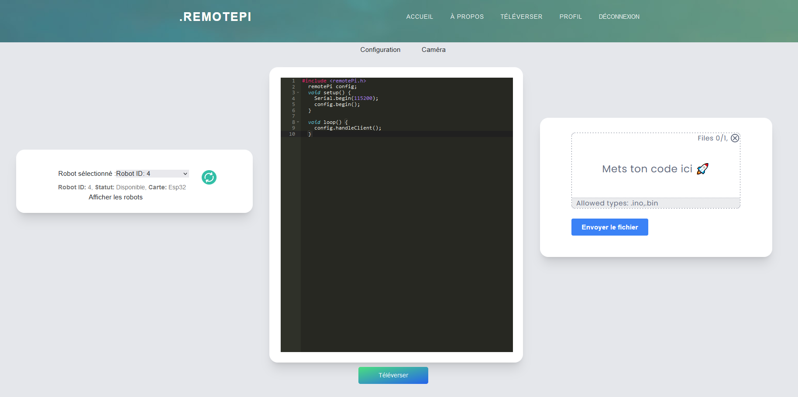
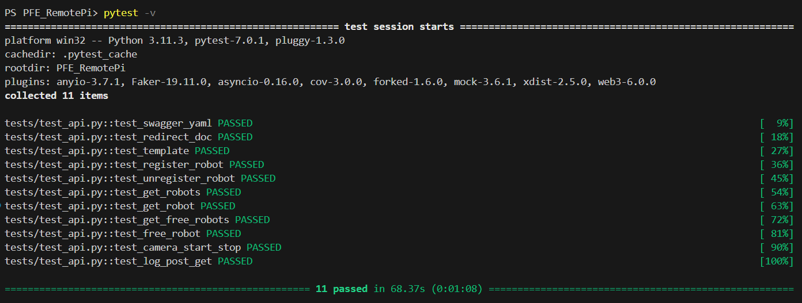
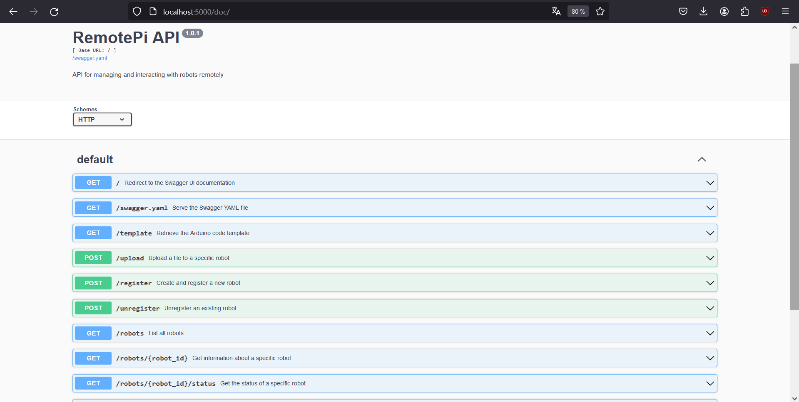

# PFE RemotePi

[](https://pfe-remote-pi.vercel.app/)

## Table des matières

- [Introduction](#introduction)
- [Utilisation](#utilisation)
  - [Interface web](#interface-web)
  - [Création de compte](#création-de-compte)
  - [Administrateurs](#administrateurs)
- [Développement](#développement)
  - [Matériel](#matériel)
  - [Téléchargement local](#téléchargement-local)
  - [Backend](#backend)
  - [Compilation](#compilation)
  - [Interface web](#interface-web-1)
  - [Tests [optionnel]](#tests--optionnel-)
  - [Documentation](#documentation)
- [L'équipe](#léquipe)
  - [Majeure Systèmes d'Information et Cybersécurité](#majeure-systèmes-dinformation-et-cybersécurité)
  - [Majeure Systèmes embarqués](#majeure-systèmes-embarqués)

## Introduction

Ce projet de fin d'études a comme objectif de fournir une plateforme web visant les groupes d'étudiants voulant travailler à distance et à toute heure de la journée sur leurs divers projets d'électronique.

## Utilisation

### Interface web

L'interface web de RemotePi est accessible à l'adresse <https://pfe-remote-pi.vercel.app>.

_NOTE: Le matériel ayant été rendu à la fin du PFE, la compilation de code et le retour caméra ont depuis été désactivés sur ce déploiement._

### Création de compte

Inscrivez-vous via l'onglet `SE CONNECTER`, en cliquant sur `Nouveau sur RemotePi? S'INSCRIRE`.

Remplissez les champs, et confirmez votre adresse mail via l'email reçu.

Une fois votre inscription terminée, un administrateur doit valider votre compte pour vous donner accès au reste de la plateforme.

### Téléversement

L'onglet `Téléverser` permet de lister et choisir un robot sur lequel téléverser le choisi.

Le code peut-être édité directement dans l'IDE intégré à la page principale, ou importé du disque par le formulaire d'envoi de fichiers.



### Administrateurs

Les comptes administrateurs disposent d'un onglet `Admin` supplémentaire, accessible dans `PROFIL` -> `Accéder à l'Administration`.

Cet onglet permet de valider les comptes utilisateurs en attente, de révoquer les accès à un compte. Dans le cas où les IP de la backend et de la caméra ne sont pas fixes (c.f. [Développement](#développement)), elles peuvent aussi être modifiées dans cet onglet.

## Développement

### Matériel

- Raspberry Pi utilisée : [Raspberry Pi 4 Module B](https://www.raspberrypi.com/products/raspberry-pi-4-model-b/)
- Caméra utilisée : [Raspberry Pi Camera Module 3](https://www.raspberrypi.com/products/camera-module-3/)

_Note : Le projet a été mené et testé uniquement avec les modèles énoncés ci-dessus. Il se peut que le processus d'installation diffère pour tout autre modèle._

### Téléchargement local

Cloner le projet :

```bash
git clone https://github.com/ElmoAlreadyTaken/PFE_RemotePi
cd PFE_RemotePi
```

### Backend

Se déplacer dans le dossier `server` :

```bash
cd server
```

Installer les paquets APT nécessaires:

```bash
sudo apt update && sudo apt install -y libcamera-apps libcamera0 && \
curl -s https://ngrok-agent.s3.amazonaws.com/ngrok.asc | sudo tee /etc/apt/trusted.gpg.d/ngrok.asc >/dev/null && echo "deb https://ngrok-agent.s3.amazonaws.com buster main" | sudo tee /etc/apt/sources.list.d/ngrok.list && sudo apt install ngrok
```

Installer les modules python nécessaires :

```bash
pip install -r requirements.txt
```

Démarrer le serveur backend local :

```bash
python server.py
```

La backend est accessible sur **<http://localhost:5000>**.

[optionnel] Cette dernière sous-partie est optionnelle, pour exposer publiquement la backend sur Internet.

Créer un compte ngrok, et modifier le `authtoken` dans `ngrok/ngrok.conf`.

Au lieu de démarrer la backend avec `python server.py`, nous allons utiliser le script `startServers.sh` qui se trouve dans le dossier `servers`.

Démarrer le serveur Flask, et les tunnels ngrok pour le serveur et la caméra :

```bash
./startServers.sh
```

Ce script génèrera deux IP publiques:

- Une pour la backend, hebergée en local sur le port 5000
- Une pour la caméra, hébergée en local sur le port 8888

Ces deux IP publiques seront à renseigner dans l'onglet `Admin` de l'interface web.

### Compilation

Pour activer et configurer la compilation de code de la Raspberry Pi vers les ESP8266, se référer au [guide de prise en main du projet](./guide-prise-en-main.pdf).

### Interface web

Se déplacer dans le dossier `interface` :

```bash
cd ../interface
```

Installer les paquets `npm` :

```bash
npm install
```

Déployer l'interface web :

```bash
npm run dev
```

L'interface web est accessible sur **<http://localhost:3000>**.

Pour le dévelopement, il est possible d'ajouter manuellement les IP publiques et ports attribuées à la backend et au serveur Flask par `ngrok`.

Pour ce faire, rendez-vous dans le panel Admin de l'interface Web, et entrez les IP et ports générés par `ngrok` lors de l'exécution du script `startServers.sh`.

Une fois ces champs mis à jour, l'interface Web pourra fonctionner correctement.

### Tests [optionnel]

Pour s'assurer du bon déploiement et fonctionnement des différents services, RemotePi fournit un module de `tests`.

Pour l'exécuter, placez-vous dans le dossier `server` et entrez la commande :

```bash
pytest -v
```

Si vous avez correctement suivi les étapes de déploiement du projet, tous les tests devraient apparaître en vert au bout de quelques minutes.



### Documentation

La documentation de l'API au format Swagger UI est accessible sur <https://localhost:5000/doc>.

Il est possible de tester les différents paramètres des requêtes, observer les réponses de la backend, etc.



Cette page permet d'accélérer le développement ainsi que le débogage pendant les phases de tests.

## L'équipe

### Majeure Systèmes d'Information et Cybersécurité

- **Misha Setta**: Implémentation de la plateforme web
- **Nassim Si Mohammed**: Implémentation de la plateforme web
- **Axel Pape**: Implémentation du serveur et de l'API pour la communication plateforme web <--> serveur
- **Quentin Sereno**: Implémentation du serveur et de l'API pour la communication plateforme web <--> serveur

### Majeure Systèmes embarqués

- **Alexandre Santos Gomes**: Gestion des robots et transfert de code
- **Maxime Peres**: Gestion des robots et transfert de code
